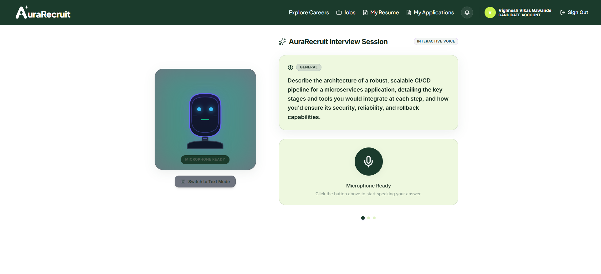
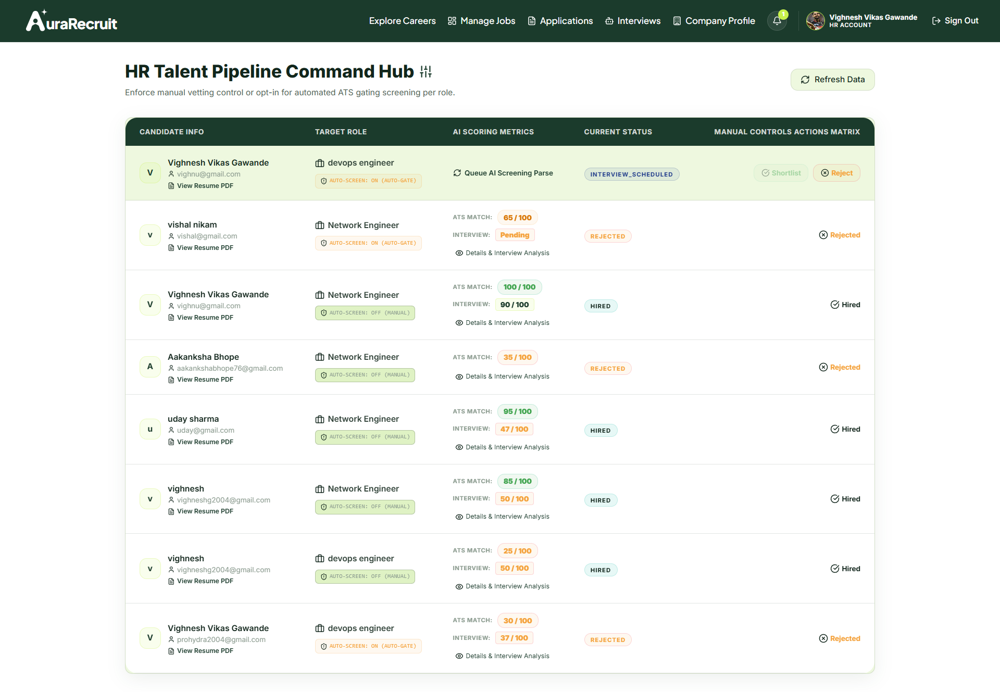
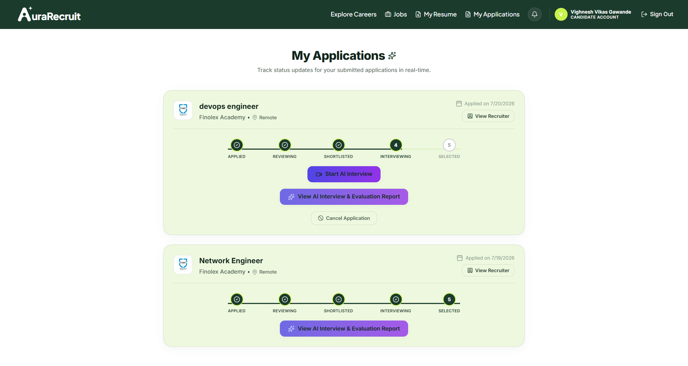
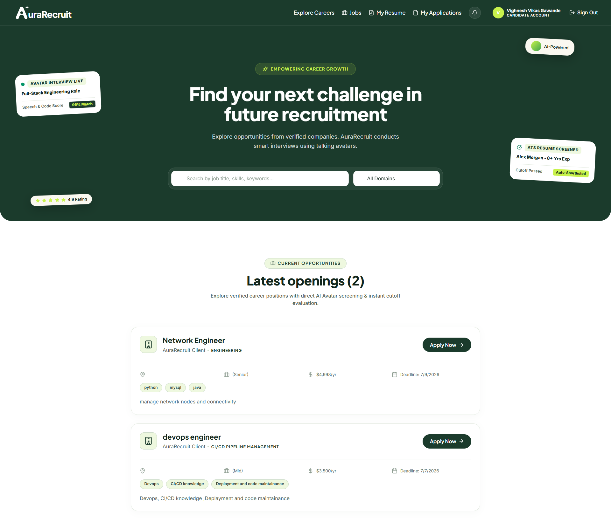

# 🌟 AuraRecruit — AI-Powered Recruitment & Avatar Interview Platform

AuraRecruit is an enterprise-grade AI recruitment platform with automated resume parsing, ATS scoring, and real-time talking-avatar interviews via voice or text.

---

### 🖥️ Platform Previews

<p align="center">
  
</p>

<br />

<p align="center">
  
</p>

<br />

<p align="center">
  
</p>

<br />

<p align="center">
  
</p>

---

## 🚀 Installation & Setup

### Prerequisites
- **Node.js** v18+ and **npm** v9+
- **Python** 3.10+
- **MongoDB Atlas** account (or local MongoDB instance)
- **Google Gemini API Key** ([Get one here](https://aistudio.google.com/app/apikey))
- **Cloudinary** account for resume PDF storage

---

### Step 1 — Clone the Repository

```bash
git clone https://github.com/Vighnesh7711/AI-recruitment.git
cd AI-recruitment
```

---

### Step 2 — Install All Dependencies

**Windows (Recommended — runs everything automatically):**
```cmd
install-all.bat
```

**macOS / Linux:**
```bash
chmod +x install-all.sh
./install-all.sh
```

> This installs all Node.js workspace packages, creates the Python virtual environment, installs Python requirements, and generates default `.env` files.

---

### Step 3 — Configure Environment Variables

Update the generated `.env` files with your actual credentials:

**`client/.env`**
```env
VITE_API_URL=http://localhost:5000
VITE_AVATAR_URL=http://localhost:5002
VITE_APP_NAME=AuraRecruit Platform
```

**`server/.env`**
```env
PORT=5000
CLIENT_URL=http://localhost:5173
MONGODB_URI=mongodb+srv://<username>:<password>@cluster0.mongodb.net/aurarecruit
JWT_SECRET=your_jwt_secret_here
GEMINI_API_KEY=your_gemini_api_key
PYTHON_AI_URL=http://localhost:8002
AVATAR_SERVICE_URL=http://localhost:5002
CLOUDINARY_CLOUD_NAME=your_cloudinary_name
CLOUDINARY_API_KEY=your_cloudinary_api_key
CLOUDINARY_API_SECRET=your_cloudinary_api_secret
N8N_WEBHOOK_REGISTRATION=http://localhost:5678/webhook/registration
N8N_WEBHOOK_RESUME_REJECTED=http://localhost:5678/webhook/resume-rejected
N8N_WEBHOOK_INTERVIEW_SCHEDULED=http://localhost:5678/webhook/interview-scheduled
N8N_WEBHOOK_INTERVIEW_REMINDER=http://localhost:5678/webhook/interview-reminder
N8N_WEBHOOK_INTERVIEW_COMPLETE=http://localhost:5678/webhook/interview-complete
N8N_WEBHOOK_OFFER=http://localhost:5678/webhook/offer
```

**`python-ai/.env`**
```env
APP_ENV=development
GEMINI_API_KEY=your_gemini_api_key
SERVER_URL=http://localhost:5000
PORT=8002
```

**`avatar-service/.env`**
```env
NODE_ENV=development
PORT=5002
SERVER_URL=http://localhost:5000
GEMINI_API_KEY=your_gemini_api_key
CLIENT_URL=http://localhost:5173
```

---

### Step 4 — Seed the Database

Initialize MongoDB with default job postings and demo accounts:
```bash
npx tsx database/seed.ts
```

---

### Step 5 — Start All Services

**Windows (Command Prompt):**
```cmd
start-all.bat
```

**Windows (PowerShell):**
```powershell
.\start-all.ps1
```

**macOS / Linux:**
```bash
./start-all.sh
```

This launches all 5 services simultaneously in separate terminal windows:

| Service | URL | Description |
| :--- | :--- | :--- |
| **Frontend** | http://localhost:5173 | React candidate & HR dashboard |
| **API Server** | http://localhost:5000 | Express REST backend |
| **Python AI** | http://localhost:8002 | FastAPI resume parser & Gemini ATS |
| **Avatar Service** | http://localhost:5002 | Talking avatar & WebRTC engine |
| **n8n Automation** | http://localhost:5678 | Email & calendar workflows |

---

### Step 6 — Stop All Services

**Windows:**
```cmd
stop-all.bat
```

**macOS / Linux:**
```bash
./stop-all.sh
```

---

### Step 7 — (Optional) n8n Workflow Setup

1. Open `http://localhost:5678` after launching.
2. Go to **Workflows → Import from File**.
3. Import all JSON files from the `n8n/` folder.
4. Connect credentials: **Gmail OAuth2**, **Google Calendar OAuth2**, **Google Sheets OAuth2**.
5. Toggle each workflow to **Active**.

---

## 📂 Project Structure

```
ai-interview-platform/
├── client/              # Vite + React 18 + TypeScript frontend
├── server/              # Node.js + Express + TypeScript API
├── python-ai/           # FastAPI resume parser + Gemini ATS scoring
├── avatar-service/      # Talking avatar WebRTC engine (Node.js)
├── database/            # Shared Mongoose models & seed scripts
├── n8n/                 # Workflow automation JSON files
├── docs/                # Architecture docs & screenshots
├── install-all.bat      # Windows auto-installer
├── install-all.sh       # macOS/Linux auto-installer
├── start-all.bat        # Windows service launcher
└── start-all.sh         # macOS/Linux service launcher
```

---

## ⚙️ Architecture

```
React Frontend (5173)
        │
        ▼
Node.js API Server (5000)
    │           │
    ▼           ▼
Python AI    Avatar Service
(FastAPI      (Node.js
 8002)         5002)
    │           │
    └─────┬─────┘
          ▼
   Google Gemini API
          │
          ▼
    MongoDB Atlas
```
