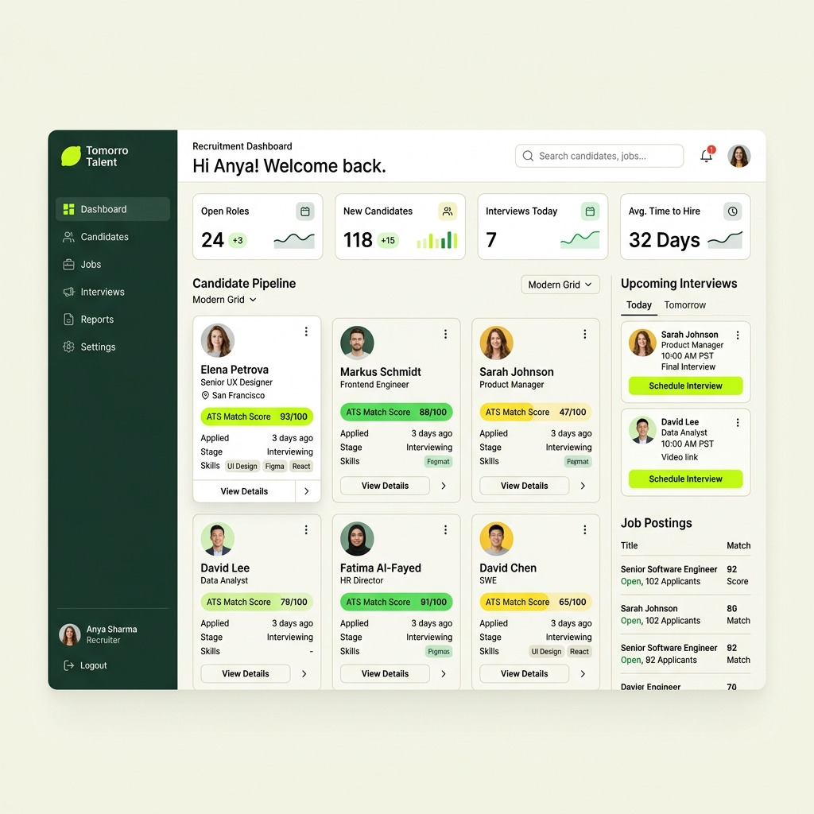
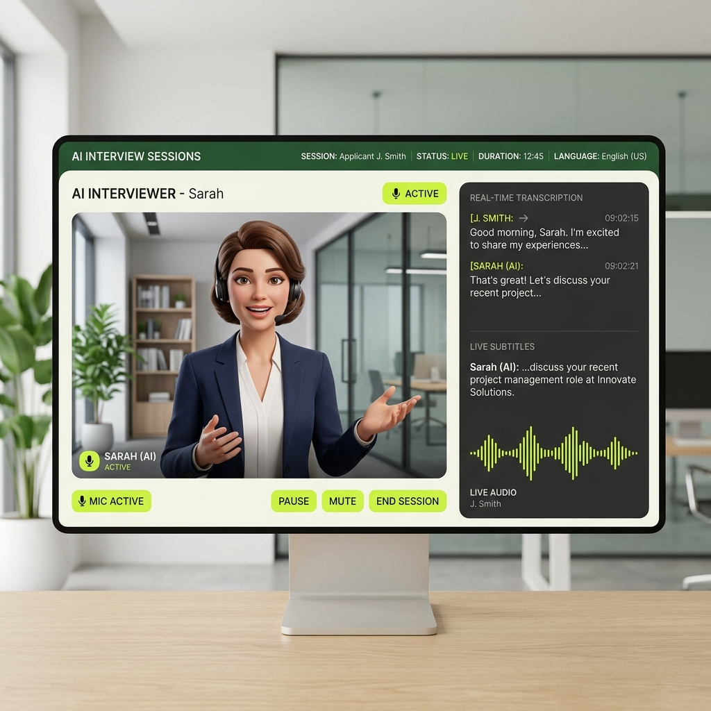

# 🌟 AuraRecruit — AI-Powered Recruitment & Talking-Avatar Interview Platform

AuraRecruit is a premium, enterprise-grade AI recruitment automation platform. It features automated resume parsing, ATS evaluation scoring, job posting management, and real-time interactive AI talking-avatar interviews (via text and voice). 

The entire visual system has been upgraded to the premium **Tomorro Design System**, featuring high-contrast interactive elements, soft organic canvases, and beautiful layered card aesthetics.

### 🖥️ Platform Previews
<p align="center">
  
  
</p>

---

## 🎨 Tomorro Design System & Premium Aesthetics

AuraRecruit uses a customized implementation of the **Tomorro Design System**, mapped via CSS variables in `client/src/index.css`. The palette is centered around brand-specific, high-contrast, organic tones:

*   **Primary Brand Colors**:
    *   `--color-lime` (`#c8f24c`): Vibrant lime accent color for primary buttons, tags, and highlights.
    *   `--color-lime-light` (`#e4ffa8`): Light lime highlights for hover states.
    *   `--color-ink` (`#12261c`): Deep charcoal-green ink for primary headings, text, and solid button surfaces.
*   **Body & Muted Tones**:
    *   `--color-body` (`#4f5f54`): Soft green-gray body text.
    *   `--color-muted` (`#8a9a8e`): Secondary, inactive, or placeholder text.
*   **Surfaces & Borders**:
    *   `--color-cream` (`#faf8f0`): Warm off-white background canvas.
    *   `--color-canvas` (`#ffffff`): Crisp, layered white for card overlays, table rows, and modals.
    *   `--color-hairline` (`rgba(18, 38, 28, 0.12)`): Faint, high-contrast border definition.
    *   `--color-hairline-strong` (`rgba(18, 38, 28, 0.22)`): Darker, defined border lines for active states and input focuses.

> [!NOTE]
> All buttons have dynamic high-contrast hover states. When a light-themed interactive button is hovered, its background turns to deep brand forest green (`var(--color-dark-green)`) and its text & icon symbols are instantly forced to bright white (`#ffffff`) for excellent legibility.

---

## 📂 Repository Workspaces Structure

AuraRecruit is managed as an `npm workspaces` monorepo:

```text
ai-interview-platform/
├── client/                     # Vite + React 18 + TypeScript Frontend Client
│   ├── src/
│   │   ├── components/         # Reusable UI components (buttons, navbar, fields)
│   │   ├── lib/                # Library utilities (axios client, configs)
│   │   ├── pages/              # Main routing views (Careers, Onboarding, Leaderboards)
│   │   └── index.css           # Styling setup (TailwindCSS overrides & Tomorro tokens)
│   └── vercel.json             # Vercel deployment specification
│
├── server/                     # Node.js + Express + TypeScript Backend API Server
│   ├── src/
│   │   ├── lib/                # Database connection pools, Cloudinary configuration
│   │   ├── routes/             # REST API endpoints (auth, job, application, interview)
│   │   ├── scheduler.ts        # Node-cron background jobs for notifications
│   │   └── index.ts            # Entry point for backend Express app (Port 5000)
│
├── python-ai/                  # FastAPI Service (Resume PDF parsing + Gemini 2.5 ATS)
│   ├── app/
│   │   └── main.py             # PyMuPDF parser, Google Gemini SDK structure
│   └── requirements.txt        # Core dependencies (fastapi, google-genai, PyMuPDF)
│
├── avatar-service/             # Express Node.js Talking Avatar SDK Wrapper (Port 5002)
│   └── src/index.ts            # WebRTC streaming, video triggers, fallback handlers
│
├── database/                   # Shared Mongoose Models & Schemas
│   ├── User.ts                 # Candidate & HR profile collections
│   ├── JobPosting.ts           # Job descriptions, status parameter, ATS thresholds
│   ├── connection.ts           # Database bootstrap/connection helper
│   └── seed.ts                 # Seeding scripts for initial testing
│
└── n8n/                        # n8n Workflow automation JSON files
```

---

## ⚙️ Service Architecture & Connections

```
                    ┌──────────────────────┐
                    │   React Frontend     │
                    │   (Vite + TS)        │
                    │   Port 5173          │
                    └──────────┬───────────┘
                               │ REST (axios)
                               ▼
                    ┌──────────────────────┐
                    │   Node.js API Server │
                    │   (Express + TS)     │
                    │   Port 5000          │
                    └──────┬───────┬───────┘
                           │       │
              REST (axios) │       │ REST (axios)
                           ▼       ▼
          ┌────────────────────┐  ┌─────────────────────┐
          │  Python AI Service │  │  Avatar Service      │
          │  (FastAPI)         │  │  (Express + TS)      │
          │  Port 8002         │  │  Port 5002           │
          └────────┬───────────┘  └──────────┬──────────┘
                   │                          │
                   │  Google Gemini API       │  Gemini API
                   ▼                          ▼
          ┌──────────────────────────────────────────────┐
          │              MongoDB Atlas                   │
          └──────────────────────────────────────────────┘
```

| Service | Environment / Tech | Default Port | Primary Function |
| :--- | :--- | :--- | :--- |
| **Client Frontend** | Vite + React + TS | `5173` | Candidate/HR Dashboard and Interview Engine |
| **API Server** | Node.js + Express | `5000` | Database orchestration, scheduler, webhooks |
| **Python AI** | Python + FastAPI | `8002` | Resume PDF processing & Gemini ATS evaluation |
| **Avatar Wrapper** | Node.js + Express | `5002` | WebRTC audio/visual talking avatar interface |
| **n8n Automation** | n8n Engine | `5678` | Email notifications & Calendar synchronization |

---

## 🚀 Step-by-Step Installation & Setup

### Option A: Automated Bootstrapping (Recommended)

To install all monorepo dependencies, configure virtual environments, and output default env files, run the installer script for your OS:

*   **On Windows**:
    ```cmd
    install-all.bat
    ```
*   **On macOS or Linux**:
    ```bash
    chmod +x install-all.sh
    ./install-all.sh
    ```

---

### Option B: Manual Installation

#### 1. Monorepo Workspace Installation
Run this at the project root to install all workspaces dependencies:
```bash
npm install
```

#### 2. Python Virtual Environment Setup
Create a virtual environment inside the `python-ai` directory and install the Gemini and PDF parser dependencies:

*   **On Windows**:
    ```cmd
    cd python-ai
    python -m venv venv
    call venv\Scripts\activate.bat
    pip install -r requirements.txt
    cd ..
    ```
*   **On macOS/Linux**:
    ```bash
    cd python-ai
    python3 -m venv venv
    source venv/bin/activate
    pip install -r requirements.txt
    cd ..
    ```

#### 3. Database Seeding
Initialize MongoDB with seed collections for companies, job postings, and demo HR administrators:
```bash
npx tsx database/seed.ts
```

---

## 🔒 Environment Configurations

Create `.env` files in their respective folders matching the specs below:

### 1. Client App (`client/.env`)
```env
VITE_API_URL=http://localhost:5000
VITE_AVATAR_URL=http://localhost:5002
VITE_APP_NAME=AuraRecruit Platform
```

### 2. Backend Server (`server/.env`)
```env
PORT=5000
CLIENT_URL=http://localhost:5173
MONGODB_URI=mongodb+srv://<username>:<password>@cluster0.mongodb.net/aurarecruit
JWT_SECRET=super_random_jwt_secret_key_change_in_production
GEMINI_API_KEY=AIzaSy...your_gemini_key
PYTHON_AI_URL=http://localhost:8002
AVATAR_SERVICE_URL=http://localhost:5002
CLOUDINARY_CLOUD_NAME=your_cloudinary_name
CLOUDINARY_API_KEY=your_api_key
CLOUDINARY_API_SECRET=your_api_secret

# Local/Remote n8n webhooks
N8N_WEBHOOK_REGISTRATION=http://localhost:5678/webhook/registration
N8N_WEBHOOK_RESUME_REJECTED=http://localhost:5678/webhook/resume-rejected
N8N_WEBHOOK_INTERVIEW_SCHEDULED=http://localhost:5678/webhook/interview-scheduled
N8N_WEBHOOK_INTERVIEW_REMINDER=http://localhost:5678/webhook/interview-reminder
N8N_WEBHOOK_INTERVIEW_COMPLETE=http://localhost:5678/webhook/interview-complete
N8N_WEBHOOK_OFFER=http://localhost:5678/webhook/offer
```

---

## 🛡️ Scaled Rate Limit Thresholds (Development-Friendly)

To support active testing and local dashboard reloading, the application has upgraded rate limiting rules:
*   **General API Rate Limiter**: Configured at **10,000 requests** per 15 minutes to support continuous component rendering.
*   **Auth Rate Limiter (Login/Register)**: Configured at **1,000 requests** per 15 minutes per IP. This prevents accidental lockouts and lets you test candidate register loops fluidly.

---

## 🏃 Running the Application

### Launching All Services at Once
Open your terminal in the root folder and run:
*   **Windows (Command Prompt)**: `start-all.bat`
*   **Windows (PowerShell)**: `.\start-all.ps1`
*   **macOS / Linux**: `./start-all.sh`

### Stopping All Services
To cleanly kill processes running on backend/frontend/AI/n8n ports:
*   **Windows**: `stop-all.bat`
*   **macOS / Linux**: `./stop-all.sh`

---

## 🤖 Local n8n Setup
1. Launch n8n: `npx n8n start` (runs at `http://localhost:5678`).
2. Go to the dashboard, click **Workflows** -> **Import from File**, and select the JSON configurations inside the `n8n/` folder.
3. Link your credentials under **Gmail OAuth2**, **Google Calendar OAuth2**, and **Google Sheets OAuth2**.
4. Set the workflow toggles to **Active** to begin automated dispatch!
